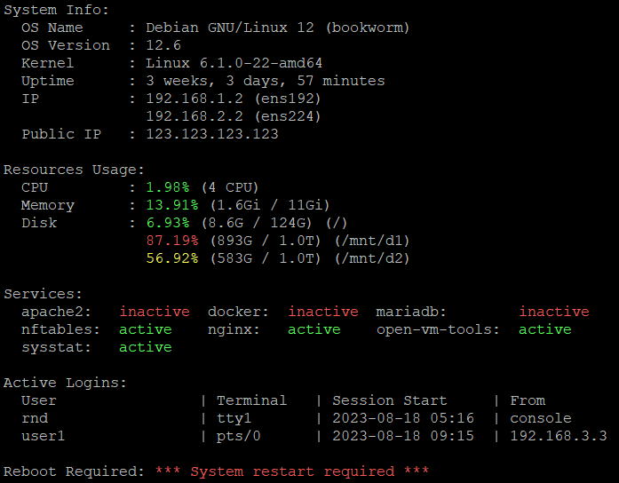

# ZN - MOTD (Message of the Day)
## Overview
`zn-motd` is a clean and efficient MOTD (Message of the Day) banner for Linux systems. It provides a quick glance at essential system information, helping administrators and users quickly assess the state of their system. 

## Features
- **System Info**: Shows OS name, version, kernel, uptime, IP addresses.
- **Resources Usage**: Displays CPU usage, memory usage, and disk usage.
- **Services**: Lists the status of key services.
- **Active Logins**: Details on current active user sessions.
- **Reboot Status**: Indicates if a system restart is required.

## Sample Output
Here's a sample output of the `zn-motd` banner:


## Installation
The installation script will automatically:
- Install `curl` and `sysstat` if they are not already installed.
- Detect installed services and exclude known services that are not worth monitoring.
- Create `motd` command under the `/usr/bin` directory.

### Requirements
The following packages are required:
- `curl`
- `sysstat` (for `mpstat`)
- `systemd`

`zn-motd` has been tested on the following systems:

- **Debian-based**: Debian and Ubuntu
- **RHEL-based**: Rocky Linux

Please note that while `zn-motd` has only been tested on the systems listed above, it may work on other distributions as well. Compatibility with other operating systems is not guaranteed.

### Installation Steps

1. Clone the Repository:

    ```bash
    git clone https://github.com/zharfanug/zn-motd.git
    ```

2. Navigate to the Project Directory:

    ```bash
    cd zn-motd
    ```

3. Run the Installation Script:

    ```bash
    chmox +x install.sh
    ./install.sh
    ```

## Configuration (optional)
The services displayed in the MOTD banner are adjustable via the `zn-config` file. To customize the services:

1. Copy the sample configuration file:

    ```bash
    cp zn-config.dist zn-config
    ```

2. Edit `zn-config` to adjust the services according to your preferences. 

3. To apply changes, re-run the install.sh script:

    ```bash
    ./install.sh
    ```

## Usage
To display the MOTD banner, you can either:

- Run the `motd` command
  ```bash
  motd
  ```
- Or simply log in, and the banner will automatically be displayed

---

This project is inspired by [yboetz/motd](https://github.com/yboetz/motd).

For more information or to explore additional projects, visit my GitHub profile: [zharfanug](https://github.com/zharfanug)