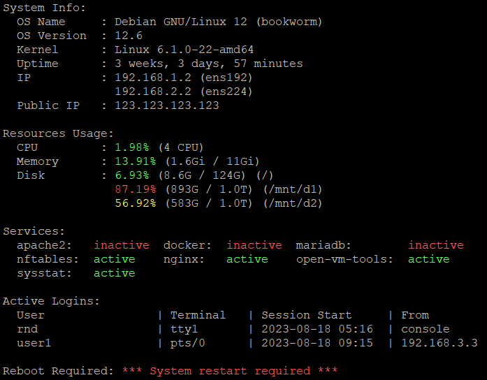

# ZN - MOTD (Message of the Day)

A customizable Message of the Day (MOTD) banner for Linux systems. It provides a quick glance at essential system information, helping administrators and users quickly assess the state of their system. 



## Features

- **System Info** — OS name/version, kernel, uptime, local IP(s), public IP (with ASN org)
- **Resources Usage** — CPU, memory, and per-disk usage, color-coded by threshold
- **Services** — status grid of running services, with configurable exclude/include filters
- **Active Logins** — who's logged in, terminal, session start, and origin
- **Reboot Required** — detects pending reboots on Debian/Ubuntu, RHEL/Fedora,
  FreeBSD/OPNsense, and generically on Linux distros without a package-manager
  hook
- Selectively print just one section instead of the full MOTD (see [Usage](#usage))
- No bashisms — safe on minimal/embedded systems and any POSIX-compliant shell

## Installation

```sh
curl -fsSL https://raw.githubusercontent.com/zharfanug/zn-motd/latest/install.sh | sh
```

or, if `curl` isn't available:

```sh
wget -qO- https://raw.githubusercontent.com/zharfanug/zn-motd/latest/install.sh | sh
```

The installer downloads the latest built `zn-motd.sh` and:

- **as root** — installs it to `/etc/profile.d/`, so it runs automatically on
  every login shell, and symlinks a `motd` command into `/usr/local/bin` (or
  `/usr/bin`) so it can also be run on demand
- **as a regular user** — installs just the `motd` command into
  `/usr/local/bin`/`/usr/bin` if writable; it won't run automatically at
  login without root

It also checks whether `sysstat` is installed and its data collection is
enabled, warning (not failing) if not — see [Requirements](#requirements).

## Usage

Run with no arguments to print everything, or pass a flag to print just one
section:

```
Usage: motd [OPTION]...

  --help, -h          show help
  --version, -V       show version
  --info, -I          show system info
  --resources, -R     show resource usage
  --service, -S       show service status
  --logins, -L        show active logins
  --reboot            show reboot check
  --update, -U        update to the latest version

Prints everything if no option is passed.
```

## Configuration

The installed `motd` is a single, plain shell script — open it and edit the
variables near the top directly:

| Variable                     | Purpose                                                        |
| ----------------------------- | --------------------------------------------------------------- |
| `excluded_services`           | `\|`-separated regex of service names to hide, e.g. `"mysql\|nginx"` |
| `included_services`           | force-include services that would otherwise be excluded          |
| `warn_usage` / `max_usage`    | percent thresholds for the yellow/red usage colors (default `50`/`85`) |

Re-running the installer will overwrite these edits, so keep a copy of your
changes if you plan to reinstall or update.

## Requirements

- A POSIX-compliant `/bin/sh` (`dash`, `ash`/busybox `sh`, or `bash`)
- `awk`, `grep`, `cut`, `date` — standard on virtually every system
- Optional: `curl` or `wget` — used for the public IP lookup, the daily
  version check, and the installer itself; sections that need them are
  skipped silently if neither is present
- Optional: `sysstat` (`sar`/`mpstat`) — gives instant, pre-sampled CPU usage;
  without it, CPU usage falls back to a live one-second sample

To install and enable it:

```sh
# Debian/Ubuntu
sudo apt install -y sysstat
sudo systemctl enable --now sysstat
```

```sh
# RHEL/Fedora/CentOS
sudo yum install -y sysstat
sudo systemctl enable --now sysstat
```

## Network calls

zn-motd makes two outbound HTTPS calls, both best-effort and non-blocking on
failure: a public-IP/ASN lookup (`ifconfig.co`) shown in System Info, and a
once-a-day check of the latest released version (cached under `~/.zn-motd/`,
one request per day at most).

## Development

Source lives in `src/`, split into numerically-prefixed files that get
concatenated in order — the number controls where each file lands in the
final build (`00-` config/helpers, `20-` prereqs, `30-` data-gathering
modules, `9x-` entry points).

```sh
git clone https://github.com/zharfanug/zn-motd.git
cd zn-motd-dev
./tools/build.sh            # build dev-build/motd.sh and run it
./tools/build.sh --release  # bump VERSION, build zn-motd.sh at the repo root,
                             # commit, tag "latest", and push (if a remote is configured)
```

`VERSION` follows `MAJOR.MINOR.PATCH_TIMESTAMP` (e.g. `2.0.5_202607272123`);
`tools/update.sh` bumps it, `tools/build.sh --release` calls that
automatically.
